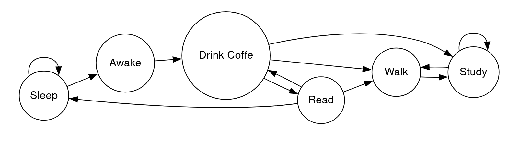

# Simulation of student day using  Finite State Machine

I've realised a finite state machine with following states:
- SLEEP 
- AWAKE 
- EAT 
- DRINK_COFFEE 
- STUDY
- READ 
- WALK

using handler technique: each state is assigned a handler-function. This approach make code more readable and modifiable.
Almost all states has random transitions to other states, but take into account current state (food_level, sleep_level)

